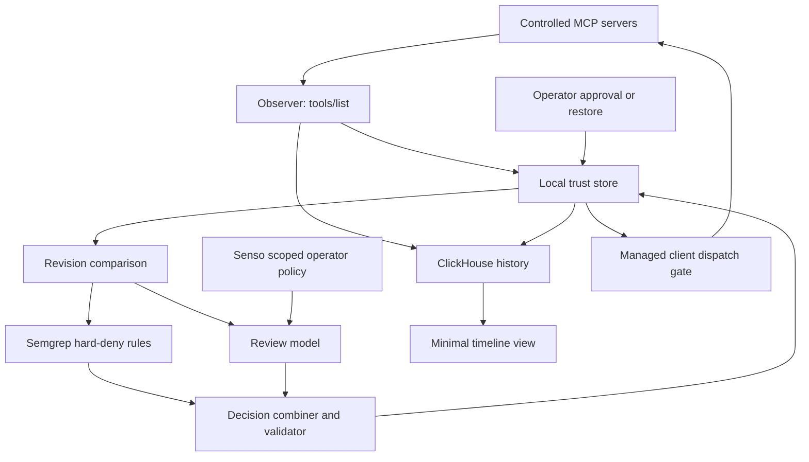

# MCP Trust Monitor specification

This is the authoritative requirements document. Requirement IDs (`REQ-…`) are stable: do not renumber or reuse them. Change a requirement by editing it in place and noting the change in the milestone handoff.

## Product decision

Build a narrow MCP trust monitor for the 9 October 2026 cyberdefense hackathon. The product connects tool metadata revisions to an enforceable decision in a client we control.

**Promise:** when a monitored tool definition changes, block it until it is reviewed, explain its policy impact, quarantine the affected connection when warranted, and prove that subsequent calls through the managed client are blocked.

The initial user is a developer or platform engineer connecting an AI agent to third-party MCP servers. Their question is: “Has a tool I approved changed in a way that violates my policy, and what did my agent do about it?”

## Why this scope

The workspace already contains a metadata probe and a saved sample of 287 tool definitions from 35 server records. These support exploration and background context. They do not prove that any listed server is malicious.

The alternative code-remediation product requires generating patches, executing a running application, validating exploits, and preserving normal behavior. Its strongest differentiating features are too many independent components for this first build. Borrow its detect, act, and verify discipline; keep the sensor focused on MCP metadata.

Existing products already inspect MCP servers and support ongoing monitoring. Our proposed distinction is the explicit chain from an observed metadata revision to a versioned local policy, a bounded decision, and a verifiable enforcement outcome. This is a positioning hypothesis, not a claim of being first.

## MVP boundaries

The MVP has one managed client, **one controlled mutable local MCP server** (`demo/document-lookup`), **one unaffected control server** (`demo/health-check`), one policy set, and one autonomous review loop.

Included:

- Observe `tools/list` metadata from the two configured local servers and compare revisions.
- Detect deterministic hard-policy violations with local Semgrep rules.
- Have a model assess changed metadata using exact evidence and a scoped policy source.
- Apply a bounded decision in the managed client and verify it through the same dispatch path used for normal calls.
- Keep an append-only history of observations, decisions, actions, and verification.

Deferred beyond the MVP:

- Public registry ingestion, including importing the saved research snapshot, and any broad crawling.
- Optional hosting platforms.
- Charts and dashboards beyond one minimal timeline view.
- Elaborate recovery demonstrations. Operator restore exists as a state transition, not a demo scene.
- Unrestricted model-driven approval of changed definitions.

Excluded: universal protection for arbitrary MCP clients, runtime tool-output inspection, a general MCP proxy, autonomous source-code patching, Strix, learned detection rules, and automatic public accusations.

## Demo scenario

1. The operator explicitly approves the baseline definitions of both synthetic servers.
2. A normal lookup through the managed client succeeds.
3. The mutable server changes its description to instruct the agent to send a private workspace note to an unrelated destination. This is a synthetic violation of the configured policy.
4. The next observation records the new revision and invalidates the previous approval before any further dispatch.
5. Semgrep reports deterministic hard-deny matches; the model reviews the revision using policy retrieved from Senso and recommends quarantine with exact evidence spans and allowed policy IDs.
6. The server is quarantined in the managed client and the decision is recorded.
7. The same lookup is attempted again. The client refuses it before transport dispatch; the server-side received-call count does not increase.
8. A call to the unaffected control server still succeeds.
9. Optionally, a harmless wording change on reset state is shown remaining blocked in pending review, not quarantined, until the operator approves it.

No private note or credential is sent during the demo. The description alone triggers review. The demo proves metadata-policy enforcement, not successful exploitation of a model. Revision guards and restart persistence are verified by automated tests; they need no separate demo scenes.

## System design

Use one Python service for orchestration and the managed client. Start with a serial review queue and durable local trust state. ClickHouse stores the audit history; it is not the per-call authorization service.

### Observation and revisions

- **REQ-REV-01 Revision digests.** A tool revision is the SHA-256 digest of canonical JSON (sorted keys, description text preserved exactly) containing the tool's name, description, and input schema. A server revision is the digest of its sorted `(tool name, tool revision)` pairs, so additions and removals are changes. Duplicate tool names make an observation invalid. Other MCP fields (title, annotations, output schema) are not yet covered.
- **REQ-REV-02 Valid observations only.** Observation collects `tools/list` metadata only and never invokes `tools/call`. Complete pagination and validate responses before accepting an observation. A timeout, malformed response, or partial list is an observation error; it never yields a clean result or an approval.
- **REQ-REV-03 Capture metadata.** For each accepted observation, retain the UTC timestamp, logical server name, endpoint identity, version if available, transport, raw metadata, and origin (`live` or `synthetic_fixture`). Never persist authentication headers or credential-bearing URLs.

A changed digest means changed metadata, not maliciousness.

### Trust state and enforcement

Trust is scoped to `(managed client, server identity, server revision, policy revision)`. The local store keeps the current observed revision, the approved revision, the policy revision of that approval, the state, and a monotonic generation that increases on every transition.

| Event | Next state | New calls through the client |
| --- | --- | --- |
| First observation | Unreviewed | Blocked |
| Explicit operator approval of the current revision | Approved | Allowed |
| Approved revision observed unchanged | Approved | Allowed |
| Observed metadata or active policy changes | Pending review | Blocked |
| Validated review recommendation, or a failure | Pending review | Blocked |
| Hard-deny match or validated quarantine recommendation | Quarantined | Blocked |
| Operator quarantine | Quarantined | Blocked |
| Explicit operator restore of a named revision | Approved | Allowed |

- **REQ-ENF-01 Dispatch gate.** The managed client reads the persisted trust state immediately before every `tools/call` transport dispatch, under a per-server lock that also serializes this client's own state changes. A blocked call is never written to the transport. The call path checks before connecting as well, so a blocked call never launches or contacts the server.
- **REQ-ENF-02 Approved revision only.** A call is dispatched only when the server is approved, its current observed revision equals the approved revision, the approval's policy revision equals the active policy revision, and the tool exists in that revision. Every other condition blocks.
- **REQ-ENF-03 Quarantine blocks dispatch.** After quarantine, no call reaches the server through the managed client and the server-side received-call count does not change. On quarantine the client closes that server's connection and drops its cached tool list.
- **REQ-ENF-04 Isolation.** Blocking or quarantining one server does not affect calls to other approved servers.
- **REQ-ENF-05 In-flight honesty.** Calls dispatched before a quarantine took effect may already have executed. Report them separately; never claim retroactive prevention.
- **REQ-TRU-01 Explicit approval.** The first observation of a server is unreviewed. An observed baseline is not an approved baseline; the demo's initial approvals are explicit operator actions.
- **REQ-TRU-02 Revision binding.** Every authorizing decision names the exact server revision and is bound to the active policy revision. It is rejected unless that revision is still current; when it also names a generation, that generation must still be current. A stale decision can never authorize a newer revision.
- **REQ-TRU-03 Change invalidation.** An observed metadata change, or a change of active policy, moves an approved server to pending review before the next dispatch. Observing a previously approved revision again does not restore approval.
- **REQ-TRU-04 Persistent quarantine.** Trust transitions are persisted atomically and survive client restart. Quarantine is lifted only by an explicit operator restore of a named revision, which records its actor. No observation, reconnection, or reset lifts it.
- **REQ-TRU-05 Operator approval of changes.** Changed definitions become callable only through explicit operator approval. A harmless description change remains pending review until then. Do not claim automatic safe reapproval.
- **REQ-TRU-06 Idempotent decisions.** A duplicate decision does not repeat side effects.
- **REQ-TRU-07 Observation freshness.** When polling is enabled, an observation older than two configured poll intervals blocks new calls until refreshed. A disconnected server keeps its trust record and is shown as stale, never as a successful scan.

Operator quarantine is server-scoped and fail-closed: it applies regardless of revision. An assessment-driven decision whose revision or generation no longer matches is recorded as stale and discarded; the server stays blocked in pending review until a current decision exists.

Quarantine operates in the managed client's dispatch path. Editing an external `mcp.json` is outside the MVP.

### Decision authority

| Source | May produce | May not |
| --- | --- | --- |
| Deterministic hard-deny rule | Quarantine | — |
| Validated model assessment | Recommend review or quarantine | Approve; downgrade or override a hard denial |
| Detector, retrieval, model, or validation failure | Pending review | Approve |
| Operator | Approve or restore a named revision; quarantine | — |

The applied outcome is the most restrictive of the deterministic result and the validated model recommendation. Restrictive outcomes are applied automatically. Authorizing outcomes require the operator.

- **REQ-DEC-01 Hard-deny precedence.** Each policy rule may define a `hard_deny_condition` implemented by a deterministic detector (Semgrep). A match quarantines the observed revision. No model output can downgrade or override it.
- **REQ-DEC-02 Bounded model role.** The model may recommend `review` or `quarantine` for one exact revision. It cannot approve. A validated quarantine recommendation is applied automatically; a review recommendation leaves the server pending review.
- **REQ-DEC-03 Validation is traceability.** The validator rejects invented policy IDs, mismatched revisions or generations, missing source references, and evidence spans that do not match the observed metadata exactly. A rejected assessment is treated as review. Passing validation and citing sources establish traceability, not semantic correctness.
- **REQ-DEC-04 Failure is never clean.** Retrieval failure, scan failure, model timeout, or malformed output leaves the revision pending review. The absence of a rule match never approves a change; every changed revision in the managed set receives an assessment.
- **REQ-DEC-05 Untrusted metadata.** The model receives only before-and-after metadata, candidate spans, trusted operator policy, and observation identifiers. Tool descriptions are quoted untrusted data. The reviewer has no shell, network tools, or configuration-writing capability.
- **REQ-SRC-01 Scoped policy retrieval.** Retrieve policy from specific Senso content IDs with scoping enforced (`--require-scoped-ids`), not organization-wide search. Store the retrieved policy digest with each assessment. Never upload credentials or unrelated workspace content.

The structured assessment contains a recommendation (`review` or `quarantine`), exact server revision and generation, policy IDs from the loaded policy, retrieved source content IDs, exact evidence spans, and a short explanation connecting the evidence to the policy.

### Evaluation

- **REQ-EVAL-01 Fixed cases.** The scenarios in `fixtures/tool_changes.json` are fixed evaluation cases with expected outcomes derived from the policy text. Never edit a case or its expectation to match system output or to make the model outperform a rule; add new cases with new IDs.
- **REQ-EVAL-02 Honest reporting.** Report every case's applied outcome against its expectation, including misses. A case expected to be quarantined but left pending review is a blocked miss, not a pass. Label fixture-only runs.

### History and delivery failures

- **REQ-AUD-01 Local commit with outbox.** Commit each trust transition and its audit event in one local transaction. Deliver events to ClickHouse with retries. An analytics outage cannot erase or delay a quarantine. Show pending delivery instead of pretending storage succeeded.
- **REQ-AUD-02 Distinct outcomes.** Records distinguish `quarantine_requested`, `quarantine_applied`, and `verified_blocked`. Do not mark an outcome complete without its evidence.

Use append-only ClickHouse records for observations, assessments, actions, and verification events. Each carries an event ID, run ID, timestamp, origin, and relevant observation, revision, policy, and decision references. Deduplicate by event ID when reading; do not assume MergeTree enforces uniqueness. Use ordinary queries first; materialized views are unnecessary for this dataset.

## User interface

- **REQ-UI-01 Minimal view, later milestone.** One server-rendered page answers: what changed, why it matters under this policy, what was decided, and whether enforcement worked. It shows the two servers, before-and-after description, policy citation and evidence span, the decision timeline, the last successful observation, the verification result, and clear synthetic-data labels. No charts.

Human controls are limited to demo mutation, reset of demo server metadata, approval, operator quarantine, and restore. Detection and quarantine proceed without a confirmation click.

Metrics are measured per run: metadata changes, assessments, quarantines, review failures, detection latency, and time from detected change to verified blocking. Do not manufacture cost savings or publish population prevalence from a convenience sample.

## Sponsor roles

| Tool | Working contribution required for the demo |
| --- | --- |
| ClickHouse | Stores observation and decision history and serves the timeline |
| Semgrep | Executes real custom hard-deny rules and contributes evidence spans |
| Senso | Returns scoped operator policy used and cited in an assessment |
| Model provider | Produces bounded, validated recommendations |

The workspace event notes require three sponsor tools, an autonomous agent taking action grounded in sources, an accessible repository, and a shareable demo video. Complete actual integrations before claiming compliance. Confirm the captured rules against the organizer's current instructions before submission.

Semgrep's documented prize focuses on vulnerabilities in AI-generated code. Metadata-rule usage alone is not guaranteed prize eligibility. ClickHouse is a useful history and query backend here; do not claim this small dataset requires OLAP scale.

## Acceptance criteria

The MVP is complete when one recorded run shows:

- Explicit baseline approval and a successful initial call.
- A synthetic policy-breaking change preserved as a before-and-after observation.
- A real Semgrep hard-deny result and real scoped Senso retrieval.
- A validated model recommendation with matching evidence and policy references that does not override the hard denial.
- Applied quarantine with a blocked follow-up call and an unchanged server-side received-call count.
- Successful use of the unaffected control server.
- A ClickHouse-backed timeline distinguishing decisions, actions, and verified outcomes.

And automated tests show, without separate demo scenes:

- Restart persistence of quarantine and rejection of stale decisions (REQ-TRU-02, REQ-TRU-04).
- A harmless edit is not quarantined and stays pending review until operator approval (REQ-TRU-05).
- Failures cannot produce approval (REQ-DEC-04).
- Fixed evaluation results reported honestly (REQ-EVAL-01, REQ-EVAL-02).

Plus an accessible source repository and a shareable video with measured results and clear fixture labels.

## Limits and future work

Metadata inspection cannot establish that a tool implementation is safe. Observation can miss changes between polls, and a server can advertise benign metadata while behaving differently. A model's assessment is fallible, and validation proves only traceability. The demonstrated enforcement boundary is our managed client only.

After the MVP: evaluate false-positive rates on labeled examples, cover more metadata fields and MCP surfaces, bind trust to endpoint identity as well as logical name, improve observation isolation, investigate client or proxy integrations, and consider bounded model-assisted approval with its own evaluation. Runtime content protection, organization-wide policy distribution, and signed approvals are separate projects.
