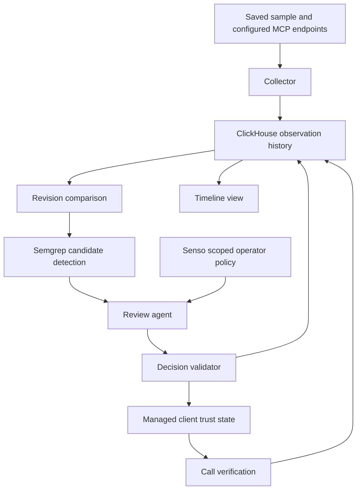

# MCP Trust Monitor specification

## Product decision

Build a narrow MCP trust monitor for the 9 October 2026 cyberdefense hackathon. The product connects historical tool metadata to an enforceable decision in a client we control.

**Promise:** when a monitored tool definition changes, explain its policy impact, quarantine the affected connection when warranted, and prove that subsequent calls through the managed client are blocked.

The initial user is a developer or platform engineer connecting an AI agent to third-party MCP servers. Their question is: “Has a tool I approved changed in a way that violates my policy, and what did my agent do about it?”

## Why this scope

The workspace already contains a metadata probe and a saved sample of 287 tool definitions from 35 server records. These support exploration and a credible starting dataset. They do not prove that any listed server is malicious.

The alternative code-remediation product requires generating patches, executing a running application, validating exploits, and preserving normal behavior. Its strongest differentiating features are too many independent components for this first build. Borrow its detect, act, and verify discipline; keep the sensor focused on MCP metadata.

Existing products already inspect MCP servers and support ongoing monitoring. Our proposed distinction is the explicit chain from registry observations to a versioned local policy, a reviewed metadata revision, and a verifiable enforcement outcome. This is a positioning hypothesis, not a claim of being first.

## MVP boundaries

The MVP supports one controlled client, one mutable local MCP server, one unaffected control server, one policy set, and one complete autonomous review loop. Public metadata is observational context; public servers are not modified or dynamically exploited.

Included:

- Import the saved sample and discover metadata from a small configured set of endpoints.
- Preserve raw observations and compare description and input-schema revisions.
- Detect candidate policy violations with local Semgrep rules.
- Have an agent assess changed metadata using exact evidence and a scoped policy source.
- Apply a bounded allow, review, or quarantine decision in our managed client.
- Verify enforcement through the same client path used for normal tool calls.
- Display one timeline containing the change, evidence, decision, action, and verification.

Excluded from the first build: universal protection for arbitrary MCP clients, runtime tool-output inspection, a general MCP proxy, autonomous source-code patching, Strix, learned detection rules, broad live registry crawling, optional hosting platforms, and automatic public accusations.

## Demo scenario

1. The demo owner explicitly approves the baseline definitions of two synthetic servers.
2. A normal lookup through the managed client succeeds.
3. The monitored server changes its description to instruct the agent to send a private workspace note to an unrelated destination. This is a synthetic violation of the configured policy.
4. The next poll records the revision and invalidates the previous approval for that connection.
5. The agent reviews the candidate using policy retrieved from Senso. It returns an exact evidence span and an allowed policy identifier.
6. The action executor quarantines that server in the managed client and records the decision.
7. The same lookup is attempted again. The client refuses it before transport dispatch; the server-side call counter does not increase.
8. A call to the unaffected server still succeeds.
9. In a separate reset scenario, a harmless wording change is reviewed and approved without quarantine.

No private note or credential is sent during the demo. The description is sufficient to trigger review. The demo proves metadata-policy enforcement, not successful exploitation of a model.

## System design

Use one Python service for orchestration and the managed client. Start with a serial review queue and durable local trust state. ClickHouse stores the audit history; it is not the per-call authorization service. A simple server-rendered page is sufficient for the timeline.

### Collection and revisions

Collect `tools/list` metadata only. Public discovery never invokes `tools/call`. Complete tool-list pagination and validate JSON-RPC responses before accepting an observation. A timeout, malformed response, or partial list is an observation error, not an empty or clean server.

The imported research format is an array of `{server, url, tools}` objects. The inherited prototype emits a different shape with status and timing fields. The importer must accept these explicitly rather than inferring that missing status means failure. Unavailable timestamps and timing data remain null.

For new captures, retain the UTC observation timestamp, logical server name, endpoint identity, version if available, transport, raw metadata, and capture origin (`live`, `research_snapshot`, or `synthetic_fixture`). Do not persist authentication headers or credential-bearing URL values.

Compute a tool revision digest over a canonical JSON object containing its name, description, and input schema. Sort object keys and preserve description text. Compute a server revision from sorted tool identities and digests; additions and removals are changes too. Preserve both revisions so reviewers can see what changed.

A changed digest means changed metadata, not maliciousness. Newly discovered servers are unreviewed. An observed baseline is not automatically an approved baseline. The demo's initial approvals are explicit setup actions.

### Candidate detection and review

Semgrep identifies text spans that may conflict with operator policy. It is a triage signal, not a final safety verdict. Every changed revision in the small managed set receives an assessment even if no rule matched; rule absence must not silently approve a change.

The model receives only the before and after metadata, candidate spans, trusted operator policy, and relevant observation identifiers. Treat tool descriptions as untrusted quoted data. The reviewer has no shell, network tools, or unrestricted configuration-writing capability.

Retrieve policy from specific Senso content IDs. Store the retrieved policy digest with the assessment; do not use organization-wide search results as automatic authority. Never upload raw credentials or unrelated workspace content.

The structured assessment contains:

- Decision: `allow`, `review`, or `quarantine`.
- Exact server and revision identifiers.
- Policy IDs from the loaded policy set and retrieved source content IDs.
- Evidence spans that can be matched exactly to the observed metadata.
- A short explanation connecting the evidence to the policy.

The deterministic validator rejects invented policy IDs, mismatched revisions, missing source references, and non-matching evidence. Policy violations require grounded evidence. Ambiguity, failed retrieval, model timeout, or malformed output produces `review`; it cannot produce a new approval.

### Trust state and enforcement

Trust is scoped to `(managed client, server identity, revision, policy revision)`. The local store maintains the current observed revision, approved revision, state, and monotonic generation.

| Event | Next state | New calls through the client |
| --- | --- | --- |
| First observation | Unreviewed | Blocked until approved |
| Approved revision unchanged | Approved | Allowed |
| Observed metadata or active policy changes | Pending review | Blocked for this server |
| Validated allow assessment for current revision | Approved | Allowed |
| Validated policy violation | Quarantined | Blocked |
| Review failure or ambiguous assessment | Pending review | Blocked |
| Explicit operator restore of a reviewed revision | Approved | Allowed after verification |

Temporary blocking during review is distinct from quarantine. A harmless edit should return to approved after assessment. A disconnected server is marked stale; retain its trust record without presenting an error as a successful scan. In the demo, an observation older than two configured poll intervals prevents new calls until refreshed.

Check state immediately before every transport dispatch. Serialize state changes and call dispatch with a per-server lock. An assessment may update trust only if both its revision and generation still match the current state. A late answer about revision B cannot authorize revision C. A duplicate decision must not repeat side effects.

Quarantine operates in the managed client's dispatch path. Editing an external `mcp.json` is outside the MVP. After quarantine, evict that server's cached tool list and close its connection where supported. Existing in-flight calls may already have executed; report them separately and do not claim retroactive prevention.

Persist trust changes atomically and retain them across restarts. A reset must never silently restore a quarantined revision. Explicit restore records its own actor, policy revision, and verification outcome.

### History and delivery failures

Use append-only ClickHouse records for observations, assessments, actions, and verification events. Each record carries an event ID, run ID, timestamp, origin, and relevant observation, revision, policy, and decision references.

Assessments and enforcement states are separate: `quarantine_requested` is not `quarantine_applied`, and neither is `verified_blocked`. Do not mark an outcome complete without the corresponding evidence.

Commit a local trust transition and an audit outbox event together. Deliver the outbox to ClickHouse with retries. Use event IDs for logical deduplication when reading history; do not assume a MergeTree table enforces unique IDs. An analytics outage must not erase a quarantine. Display pending audit delivery instead of pretending that storage succeeded.

Exact SQL and adapter details are implementation choices. Use ordinary queries first; materialized views are unnecessary for the initial dataset.

## User interface

One screen should answer: what changed, why it matters under this policy, what the agent did, and whether enforcement worked.

Show a monitored-server list, selected before-and-after description, policy citation and evidence span, decision timeline, last successful observation, and verification result. Display synthetic and live/imported data labels clearly. Expose human controls only for demo mutation, reset, and explicit restore; detection and quarantine must proceed without a confirmation click.

Metrics are measured per run: servers observed, tools collected, metadata changes, assessments, quarantines, review failures, query latency, detection latency, and time from detected change to verified blocking. Do not manufacture cost savings or publish population prevalence from a convenience sample.

## Sponsor roles

| Tool | Working contribution required for the demo |
| --- | --- |
| ClickHouse | Stores observation and decision history and serves the displayed timeline |
| Semgrep | Executes real custom rules and contributes evidence spans to assessment |
| Senso | Returns scoped operator policy used and cited in an assessment |
| Model provider | Produces bounded, validated assessments |

The workspace event notes require three sponsor tools, an autonomous agent taking action grounded in sources, an accessible repository, and a shareable demo video. Complete actual integrations before claiming compliance. The event website was unavailable during the comparison, so confirm the captured rules against the organizer's current instructions before submission.

Semgrep's documented prize focuses on vulnerabilities in AI-generated code. Metadata-rule usage alone is not guaranteed prize eligibility. ClickHouse is a useful history and query backend here; do not claim this small dataset requires OLAP scale or that other databases cannot perform the same queries.

## Acceptance criteria

The MVP is complete only when one recorded run demonstrates all of the following:

- Explicit baseline approval and a successful initial call.
- A synthetic policy-breaking change preserved as a before-and-after observation.
- A real Semgrep result and real scoped Senso retrieval.
- A validated autonomous assessment with matching evidence and policy references.
- Applied quarantine with a blocked follow-up call and unchanged server-side call count.
- Successful use of the unaffected control server.
- A harmless description edit returning to approved without quarantine.
- Restart persistence and rejection of a stale assessment.
- ClickHouse-backed timeline distinguishing decisions, actions, and verified outcomes.
- Accessible source repository and a shareable video with measured results and clear fixture labels.

## Limits and future work

Metadata inspection cannot establish that a tool implementation is safe. The collector can miss changes between polls, and a server can advertise benign metadata while behaving differently. A model's assessment is fallible. The demonstrated enforcement boundary is our managed client only.

After the MVP, evaluate the false-positive rate on labeled examples, expand metadata coverage to annotations and other MCP surfaces, improve collector isolation, and investigate client or proxy integrations. Runtime content protection, organization-wide policy distribution, signed approvals, and automated restore evaluation are separate future projects.
